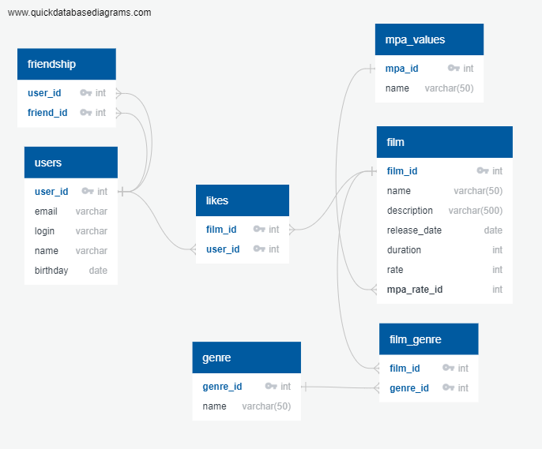

# java-filmorate
Template repository for Filmorate project.

Схема базы данных приложения:


Запрос для получения всех фильмов:
```sql
SELECT * 
FROM film;
```

Запрос для получения одного пользователя по ID:
```sql
SELECT *
FROM user AS u
WHERE u.user_id = ID;
```

Запрос для получения N наиболее популярных фильмов:
```sql
SELECT f.film_id,
       f.name
FROM film AS f
LEFT JOIN like AS l ON f.film_id = l.film_id
GROUP BY f.film_id, f.name
ORDER BY COUNT(l.user_id) DESC
LIMIT N;
```

Запрос для получения списка друзей пользователя:
```sql
SELECT fr.user_id,
       fr.name
FROM user AS u
LEFT JOIN friendship AS f ON u.user_id = f.user_id
LEFT JOIN user as fr ON f.friend_id = fr.user_id
GROUP BY u.user_id, u.name;
```